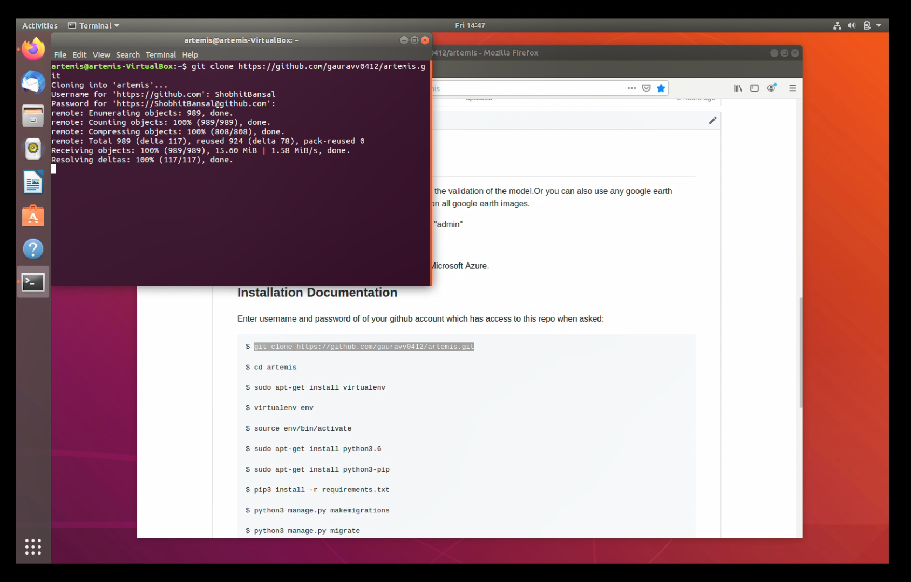
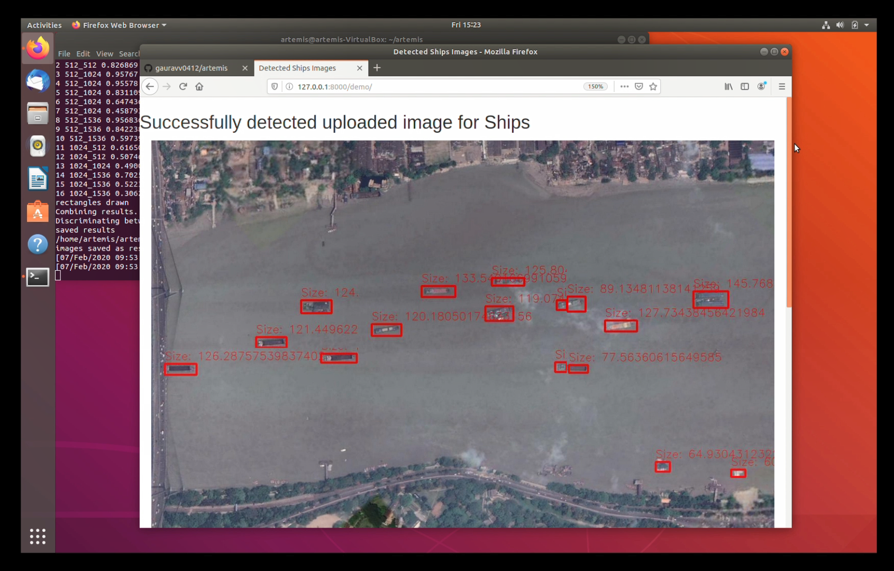

# Artemis
## Category - Software
## Problem No.- NM404
## Organisation - ISRO (Indian Space Research Organisation)
## Problem Statement - Size Invariant Ship detection from SAR Images

You can use the satellite images given in the repo for the validation of the model.Or you can also use any google earth image for the same purpose.The model works great on all google earth images.

WEBSITE DETAILS
Username - "admin"
Password - "admin"

Pass Key - "ARTEMIS" (FOR SIGNUP PURPOSE)

WEBSITE LINK : http://teamartemis.club
Hosted on Microsoft Azure.

## Installation Documentation
Youtube Video Link : https://youtu.be/dJGfQYUTWYg (Installation and Demo)

Enter username and password of of your github account which has access to this repo when asked:

	$ git clone https://github.com/gauravv0412/artemis.git
	

	$ cd artemis

	$ sudo apt-get install virtualenv

	$ virtualenv env

	$ source env/bin/activate
	

	$ sudo apt-get install python3.6

	$ sudo apt-get install python3-pip

	$ pip3 install -r requirements.txt
	

	$ python3 manage.py makemigrations

	$ python3 manage.py migrate
	

	$ pip3 install opencv-python
	

	$ sudo su

	$ apt update && apt install -y libsm6 libxext6
	

	$ sudo apt-get install libxrender1

	$ exit
	

	$ cd home/model/SIH5/model/darknet/

	$ wget https://www.dropbox.com/s/55ykehj9kra2stt/yolov3-ship_1200.weights?dl=0 -O yolov3-ship_1200.weights
	

	$ make
	

get back to artemis directory by executing next command 5 times

	$ cd ..

	$ cd ..

	$ cd ..

	$ cd ..

	$ cd ..
	

to launch server execute the following

	$ python3 manage.py runserver
	

go to browser and type http://127.0.0.1:8000/

## Website Demo

Go to Sign Up Page to create a new account

Enter the **PASSKEY as ARTEMIS** while creating an account

Go to Project Demo and upload a satellite image
( You can use sample images included in the repository )

Now the model will start working !!
( Wait for 2 mins if your VM is working on a CPU )

And the ships in the image will be detected with their respective sizes !!

